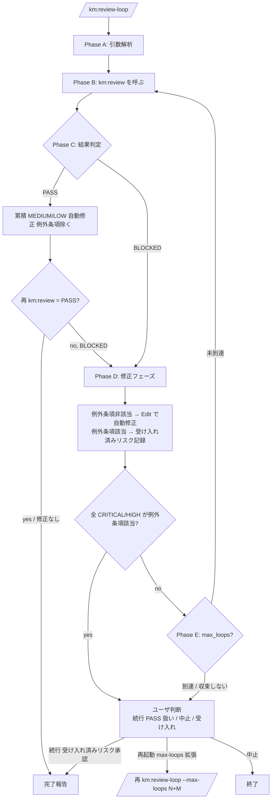

# Review Loop

km:review を反復起動し、CRITICAL/HIGH を自動修正しながら PASS まで持っていく orchestrator。完了時に累積した MEDIUM/LOW も例外条項を除いて自動修正する。

## レビューの目的

km:review は「1 回完結の診断」を返す。修正反復が必要なときは本 skill が km:review を呼びながらループ制御 / 自動修正 / 完了判定を担う。これにより:

- ユーザは 1 コマンドで「レビューが通る状態」まで持っていける
- km:review は 1 回診断 skill として独立利用も可能 (CI 報告、外部 PR 評価 等)
- 修正反復のロジック (ループ上限、例外条項、状態管理) が本 skill に集約される

## Success Criteria

- km:review が PASS を返す状態まで自動反復する
- CRITICAL/HIGH の修正は LOW を含む全指摘を Edit tool で適用 (例外条項を除く)
- 例外条項 (合意済み判断 / 影響大の修正 / 設計判断のトレードオフ) に該当する指摘は受け入れ済みリスクとして記録し、ユーザ判断を仰ぐ
- ループ上限 (`--max-loops` 既定 5) 到達時はユーザ判断を仰ぐ
- 完了レポートに loop 回数 + 受け入れ済みリスク + 修正サマリーを含める

## Workflow

### Phase A: 引数解析

`$ARGUMENTS` から以下を抽出:

- `--max-loops N`: ループ上限 (省略時 5)
- 残り token: km:review にそのまま渡す (`target` + `level`)

例:
- `/km:review-loop` → 既定 (km:review に引数なし渡し、max-loops=5)。km:review 側の「引数なしフォールバック」(uncommitted → push 済なら PR → 終了) に委譲
- `/km:review-loop pr:123 thorough` → km:review に `pr:123 thorough` 渡し、max-loops=5
- `/km:review-loop --max-loops 10 thorough` → km:review に `thorough` 渡し、max-loops=10

### Phase B: km:review を呼ぶ

`~/.claude/skills/review/SKILL.md` を Read し、その指示通りに main コンテキストで実行する。Task tool は km:review 内部の Phase 3 (3 experts 並列) でのみ発火させる。

入力: Phase A で抽出した km:review 引数。

出力: km:review が返す統合レポート (PASS or BLOCKED + 指摘リスト)。

### Phase C: 結果判定

#### PASS の場合

km:review が Phase 5 まで通過して PASS を返した。

1. レポートから累積した **MEDIUM/LOW 指摘リスト** を抽出
2. 例外条項該当指摘を除外し、残りを Edit tool で自動修正
3. 例外条項該当指摘を「受け入れ済みリスク」として記録
4. **修正後の再検証**: km:review をもう 1 回呼んで PASS を再確認 (自動修正で新規 HIGH を埋め込んでいないか確認)
   - 再検証で PASS → 完了報告 (後述) を出力して終了
   - 再検証で BLOCKED → loop カウンタ +1 して Phase D へ
5. 修正対象がゼロ (累積 MEDIUM/LOW なし) なら再検証はスキップして即時完了報告

#### BLOCKED の場合

km:review がどこかの Phase で停止し BLOCKED を返した。

1. 停止 Phase の指摘リスト (CRITICAL/HIGH + MEDIUM + LOW) を抽出 (それ以前の Phase で出た MEDIUM/LOW は最終 PASS 後の Phase C ルートで処理される)
2. Phase D (修正フェーズ) へ進む

### Phase D: 修正フェーズ

停止 Phase で出た全指摘 (CRITICAL/HIGH/MEDIUM/LOW) について (それ以前の Phase の MEDIUM/LOW は最終 PASS 後にまとめて自動修正される):

1. **例外条項該当判定**: 以下に該当する指摘か?
   - 合意済み判断 (intent context / 過去のレビューで決定済み)
   - 影響が大きい修正 (大規模な構造変更を伴う)
   - 設計判断のトレードオフ (どちらでも正解になりうる選択)
   - 修正方針が指摘内に明示されていない / 曖昧で Edit に落とせない

2. **例外条項該当時**: 「受け入れ済みリスク」として記録 (重大度 / 残す理由 / 後続対応条件)

3. **例外条項非該当時**: Edit tool で自動修正

4. **例外条項判定の集計**:
   - 自動修正対象が 1 件以上ある → Phase E (ループ判定) へ
   - **全 CRITICAL/HIGH が例外条項該当だった** (= 自動修正できる CRITICAL/HIGH がゼロ) → 即時ユーザ判断 (続行 = 受け入れ済みリスクで PASS 扱い / 中止 = 手動修正待ち)。Phase E のループには進まない

### Phase E: ループ判定

Phase D で自動修正が 1 件以上発生した後にここへ来る。次のいずれか:

- **ループ上限 (`--max-loops`) 到達** → ユーザ判断 (続行 / 中止 / 受け入れ) を仰ぐ
- **会話履歴で同一指摘が繰り返し出現** (収束しない兆候) → ユーザ判断を仰ぐ
- **それ以外** → loop カウンタ +1 して **Phase B に戻る** (km:review を再走)

## 状態管理

会話履歴ベース。orchestrator が直近の `/km:review-loop` 呼び出し回数を会話履歴から数える (永続ファイル不要)。

Claude Code セッションをまたぐ反復が必要な場合は、ユーザが `--max-loops N` で都度指定する。

## 完了報告フォーマット

```md
## km:review-loop 完了

**レビュー対象**: <target>
**実行レベル**: <level>
**ループ回数**: <N> / <max-loops>
**最終判定**: ✅ PASS

### 修正サマリー
- 修正済み CRITICAL: <count> 件
- 修正済み HIGH: <count> 件
- 修正済み MEDIUM: <count> 件
- 修正済み LOW: <count> 件

### 受け入れ済みリスク (LOW 残置)
- **<重大度>**: <問題タイトル>
  - 場所: <file:line>
  - 残す理由: <理由>
  - 後続対応条件: <条件>

### 次のアクション
- <例: km:commit でコミット、km:github-workflow で PR 化 等>
```

ループ上限到達時:

```md
## km:review-loop ループ上限到達

**ループ回数**: <max-loops> / <max-loops>
**最終判定**: ⚠️ BLOCKED (未解消の指摘あり)

### 残る指摘
- HIGH: ...
- ...

### 判断のお願い
- **続行**: `--max-loops <N+M>` で再起動
- **中止**: 現状の指摘を手動で確認し、修正後に再度 `/km:review-loop` を実行
- **受け入れ**: 残指摘を「受け入れ済みリスク」として承認し、km:commit へ進む
```

## Mermaid 図



## 自動修正の方針

1. **修正方法の決定**: 指摘の `**修正**` フィールドに記載された修正方針を読み、Edit tool で diff に適用
2. **複数指摘の処理**: 同一ファイルに複数指摘がある場合は、ファイルごとにまとめて Edit する
3. **修正検証**: Edit 後に該当ファイルの構文 / 型チェック (該当する場合) を実行し、明らかな破綻を検出したら Phase E でユーザ判断を仰ぐ
4. **修正できない場合**: 指摘の修正方針が不明確、または Edit で適用できない場合は「受け入れ済みリスク」として記録しユーザ判断を仰ぐ

## 指摘対応の方針

km:review の例外条項を継承する。検出された指摘は `LOW` を含め原則すべて自動修正対象とするが、以下は受け入れ済みリスクへ:

- 大規模な修正が必要で影響範囲が広い
- 仕様変更を伴う
- 設計判断のトレードオフがある
- 修正方針が指摘内に明示されていない / 曖昧
- 修正で他観点 (他 Phase) を壊す可能性が高い

## Safety Rules

- 自動修正は **diff snapshot の中だけ** で完結する。本 skill 単体では git commit / push は行わない (`km:commit` / `km:github-workflow` の責務)
- ループ上限を必ず尊重する。`--max-loops` を超えて自動継続しない
- 受け入れ済みリスクは必ずユーザに提示し、無断で隠さない
- 修正で diff が大幅に膨張した場合 (例: 当初 100 行 → 500 行) はループを止めてユーザ判断を仰ぐ

## 関連

- 1 回完結の診断のみ欲しい場合: `km:review`
- 完了後のコミット: `km:commit`
- PR 化: `km:github-workflow`
