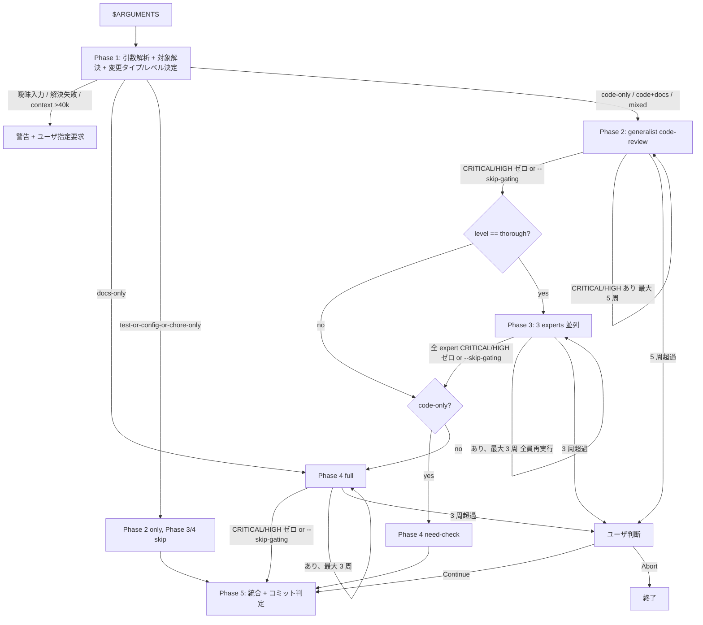

# Review

複数の review 観点を統合する review orchestrator。レビュー対象を引数 / 会話文脈から決め、レベルに応じて Phase を起動する。

## レビューの目的

開発者は目の前の実装に集中するため、設計上の問題・品質特性の見落とし・ドキュメント不整合が視野外になりやすい。本 skill は Phase 2 (generalist code review)、Phase 3 (3 専門家による別視点レビュー)、Phase 4 (doc review) を統合し、CRITICAL/HIGH を漏れなく検出する。

## Success Criteria

- 変更タイプと対象スコープに応じた Phase / 専門家を正しく選ぶ
- 要求されたレベルに応じて Phase を絞り込む
- Phase 2 / Phase 3 (3 専門家) / Phase 4 のいずれかで CRITICAL または HIGH があれば BLOCKED とする
- 実行した Phase とスキップした Phase の両方が分かるレポートにする
- `--skip-gating` 指定時は CRITICAL/HIGH 残置でも進行し、Phase 5 でユーザに判断を委ねる

## Workflow

1. **Phase 1**: 引数解析 + 対象スコープ解決 + 変更タイプ/レベル決定
2. **Phase 2**: コードレビュー (generalist) — main コンテキスト、`code-review.md` を Read して実行
3. **Phase 3**: 第三者専門家レビュー (3 名並列、Task tool) — `thorough` のみ
4. **Phase 4**: doc-review — main コンテキスト、`doc-review.md` を Read して実行
5. **Phase 5**: 統合 + コミット判定

## Phase 1: 引数解析 + 対象スコープ解決 + 変更タイプ/レベル決定

### Phase 1a. 引数パース仕様

`$ARGUMENTS` は単一文字列。**tokenize + classify の 2 段アルゴリズム** で解析する。

1. **flag 抽出 (位置不問)**: `--` プレフィックスの token を先に抽出
   - `--skip-gating`: gating 無効化フラグ (escape hatch)
   - `--uncommitted`: 明示の未コミットモード
   - `--repo`: リポジトリ全体モード (サブツリー指定が後続必要)
2. **残り token を順序評価**: flag 抽出後の残り token を以下の優先順位で分類
   1. 完全一致 `^pr$` または `^pr:[0-9]+$` → PR モード
   2. `..` を含む → コミット範囲モード
   3. `^[0-9a-f]{7,40}$` → 単一コミットモード (sha)
   4. `^(quick|standard|thorough)$` → level 指定
   5. それ以外 → 曖昧入力として警告
   6. 全 token なし → 既定 (未コミット差分)
3. **裸の数字 `42` は曖昧入力として警告**。`km:github-workflow` の `[issue-number]` 引数との混同を防ぐ。明示的に `pr:42` を要求する

### Phase 1b. 対象スコープ解決

| 対象 | コマンド | フォールバック |
|---|---|---|
| 未コミット (既定) | `git diff` + `git diff --name-only` | — |
| `<base>..<head>` | `git diff <base>..<head>` | base/head が解決できなければエラー終了 |
| `<sha>` | `git show <sha>` | sha が見つからなければエラー終了 |
| `pr` | `gh pr diff` (current branch の PR) | `gh` 未認証 or 非 GitHub repo / PR 未存在ならエラー + 別スコープ指定を促す |
| `pr:<n>` | `gh pr diff <n>` | 同上 |
| `--repo <subtree>` | `git ls-files <subtree>` で対象ファイル列挙、各ファイルを Read。HEAD vs HEAD~1 の diff ではなく現状コード全体が対象。サブツリー必須、未指定なら警告 | — |

**Context budget 防御**: `--repo <subtree>` 時は `git diff --stat <subtree>` の総行数を計算し、**1 行 ≈ 25 tokens** で概算する (混在 diff の経験則)。**約 1600 行 (≈ 40k tokens) を超える場合**はユーザに警告し、サブツリーをさらに絞るよう促す。3 並列 subagent の合算 context を考慮した保守的な閾値。

下位コンポーネント (Phase 2 / experts / Phase 4) は **「解決済みのファイル一覧 + diff 内容」** を共通コンテキストで受け取る。

### Phase 1c. 変更タイプ判定とレベル選択

変更タイプの判定入力は対象スコープに応じて変える:

| 対象 | 変更タイプ判定の入力 |
|---|---|
| 未コミット / `<base>..<head>` / `<sha>` | ファイル拡張子・変更パターン + コミットメッセージ (`refactor:` 等の Conventional 接頭辞) |
| `pr` / `pr:<n>` | `gh pr view` のタイトル/ラベル + diff |
| `--repo <subtree>` | 変更タイプ判定を行わず常に `mixed` 扱い。全 Phase を有効化 |

変更構成 (正規ラベル): `docs-only` / `code-only` / `code+docs` / `test-or-config-or-chore-only` / `mixed`。`--repo` は常に `mixed` 扱い。

レベルは `thorough` / `standard` / `quick`。Phase 1a で抽出されなければ会話文脈から推論、それも無理なら既定 `standard`。

### 引数なし呼び出しのデフォルト動作

`/km:review` (引数なし) では以下のフォールバック順で対象を決定する。`km:plan` / `km:github-workflow` 経由の dispatch でも同じ動作:

1. `git diff` で未コミット差分の有無を確認 → あれば未コミットモード
2. 未コミットなしかつ現ブランチが push 済みなら `gh pr diff` (current branch の PR) を試行 → 成功すれば PR モード
3. それも無ければ「対象がないため終了」と出力

これにより、ユーザが PR push 済の状態で `/km:review` を叩いても自動的に PR をレビューする。

## Phase 2: コードレビュー (generalist)

`code-review.md` を Read してその指示に従って main コンテキストでレビューを実施する。

**起動条件**: docs-only 以外 (`code-only` / `code+docs` / `test/config/chore` / `mixed`) で常時起動。

**入力**: Phase 1b で解決した「変更ファイル一覧 + diff 内容」、Phase 1c の変更タイプ。

**出力**: 重大度別件数 (CRITICAL/HIGH/MEDIUM/LOW) + 個別所見。

## Phase 3: 第三者専門家レビュー (3 名並列)

`thorough` レベルでのみ起動。`docs-only` / `test-or-config-or-chore-only` では起動しない (level 不問で常に skip)。

### 起動方法

**同一メッセージ内で Task tool を 3 個並行発行** する。subagent は `~/.claude/skills/review/` を参照するため、Task tool prompt 内のパスは **絶対パス (`~/` 始まり)** で書く。各 Task tool に以下のプロンプトを渡す:

```
あなたは km:review Phase 3 の <role> 専門家です。

## 役割の前提
- 同じ diff を architect / qa / security の 3 名が並列で別視点でレビューしています
- あなたは <role> の視点に集中し、他者の担当 ISO 副特性には踏み込まないでください
- 他者と矛盾する判定をしてもよい (Phase 5 統合で解消される)

## Read 順序
1. ~/.claude/skills/review/experts/<role>.md (役割定義と workflow)
2. レビュー対象の diff を pre-scan し、該当しそうな ISO 副特性に当たりをつける
3. ~/.claude/skills/review/references/iso-25010/<該当ファイル>.md (該当しそうな 1-2 ファイルのみ。役割定義に列挙されたファイルが起点)
4. ~/.claude/skills/review/experts/report-format.md (出力直前に確認)

architect は加えて ~/.claude/skills/review/references/scope-alignment.md を Read (Phase 2 との住み分け)。

## レビュー対象
- 変更ファイル一覧: <Phase 1b の出力>
- diff 内容: <raw diff>
- 変更タイプ / 規模: <Phase 1c の出力>

## 既知情報
- Phase 2 で確定した MEDIUM/LOW 指摘リスト (偽陽性フィルタの参考、同ファイル/行/同観点は除外。ただし security は重大度再評価可):
  <Phase 2 の MEDIUM/LOW 指摘 (markdown のまま貼付)。Phase 2 が指摘ゼロなら "none">
- 意図情報 (km:plan issue 本文 / 会話文脈):
  <intent または "no intent context">
  intent がある場合は「diff が intent を達成しているか」を担当観点で 1 行コメントする

## 失敗ケースの扱い
- 該当観点なし: report-format.md の「指摘ゼロ時」フォーマット
- context 不足で判定しきれない: 「判定保留」セクションに「何があれば判定できるか」を書く
- diff が大きすぎる: 担当 ISO 副特性に該当しそうな箇所だけ深掘り、それ以外は判定保留
- diff から判定するために repo 内の近隣ファイル (middleware / interceptor / 類似 endpoint) が必要なら最大 5 個まで Read してよい

## 出力形式
~/.claude/skills/review/experts/report-format.md に従う。HIGH 以上は固有フィールド (architect=長期影響、qa=再現条件、security=攻撃シナリオ+CWE/OWASP 引用) を必須記載。
```

`<role>` は `architect`, `qa`, `security` のいずれか。3 つを同一メッセージ内で発行する (sequential ではなく parallel)。

**ロール識別子と出力見出しのマッピング**: `architect` → `### システムアーキテクト`、`qa` → `### QA 専門家`、`security` → `### セキュリティ専門家`。

### 担当配分

| 専門家 | 視点 | 担当 ISO/IEC 25010 特性 |
|---|---|---|
| architect | 長期・横断・非機能 | 2 (性能効率性), 3 (互換性), 7 (保守性), 8 (柔軟性) |
| qa | 異常系・境界・運用品質 | 1 (機能適合性), 4 (インタラクション能力), 5 (信頼性) |
| security | 脅威モデル・攻撃面 | 6 (セキュリティ), 9 (安全性) |

### Phase 2 との住み分け

`references/scope-alignment.md` を参照。Phase 2 は code-level (関数・モジュール・システム境界の正しさ)、Phase 3 architect は「異なる視点 (長期・横断・非機能)」。住み分けの具体例 4 件もここに集約。

## Phase 4: doc-review

`doc-review.md` を Read してその指示に従って main コンテキストでレビューを実施する。**Phase 3 完了後** (sequential、並走させない)。

### 起動モード

Phase 1c で確定した変更構成に基づいて以下のいずれかで起動:

- **`docs-only`** (docs 変更のみ) → **full モード**。Phase 2/3 は skip して直接 Phase 4 へ
- **`code+docs`** (コード + docs 両方) → **full モード**
- **`mixed`** (`--repo` 経由) → **full モード**
- **`code-only`** (コードのみ、docs 変更なし) → **need-check モード** (軽量、ループなし、CRITICAL/HIGH 出さない)
- **`test-or-config-or-chore-only`** → **Phase 4 skip**

なお need-check モードで内部的に HIGH/CRITICAL 相当の検出があった場合は **MEDIUM に強制降格** して報告する (gating を発火させない)。

## Phase 5: 統合 + コミット判定

- Phase 2 + Phase 3 (3 専門家) + Phase 4 の指摘を重大度ごとに合算
- いずれかに CRITICAL/HIGH があれば `BLOCKED`、なければ `PASS`
- 同一ファイル・近接行で同観点の指摘が Phase 2 と Phase 3 で重複した場合の de-dup:
  - **Phase 2 ↔ Phase 3 architect** の重複は **Phase 2 側を優先カウント** (より具体的なため、`scope-alignment.md` 参照)
  - **Phase 2 ↔ Phase 3 security/qa** の重複は **Phase 3 側を優先カウント** (攻撃シナリオ・再現条件の補強情報を持つため)
- intent context があった場合、各 expert の「intent との整合性 1 行コメント」を統合サマリーに含める

### アクションリスト生成

統合レポート末尾に **優先順位付きアクションリスト** を生成する。指摘の山を「次の一手」に変換することがレビューの価値:

1. **マージ前必須** (CRITICAL/HIGH): 修正しないと BLOCKED
2. **PASS への最短経路**: 上記必須を直す具体的なステップ (該当ファイル + 修正方針サマリ)
3. **マージ後推奨** (MEDIUM): follow-up issue 候補
4. **受け入れ可能 (LOW)**: 残しても害なし
5. **指摘の相互関係**: 同一根本原因でグルーピング可能なら明示 (例: 「HIGH 1, MEDIUM 2, 3 はすべて auth middleware の責務不明確に起因 — まとめて auth 層の責務再設計で解消」)

詳細フォーマットは `report-format.md` を参照。

## Sequential gating

### 進行ゲート

**Phase N で `CRITICAL` または `HIGH` の検出件数が 0 でない限り、Phase N+1 を起動してはならない** (`--skip-gating` 指定時を除く)。LOW/MEDIUM は次 Phase の起動を阻まない。

### ループ上限 (`--skip-gating` 未指定時)

- Phase 2: 同 Phase 連続再実行 5 周まで。超過は警告してユーザ判断
- Phase 3 / Phase 4-full: 同 Phase 連続再実行 3 周まで。超過は現状の指摘リストを提示してユーザ判断
- Phase 4-need-check: ループ対象外 (1 回のみ実行)

### 修正の担当

orchestrator が編集ツールで自動修正しない。CRITICAL/HIGH が検出されたら **ユーザに修正を促し、次回の入力で同 Phase を再実行** する。

### カウンタリセット

上流 Phase に戻った場合 (例: Phase 3 で修正後に Phase 2 観点が崩れた場合) は下流 Phase のカウンタをリセット。

### `--skip-gating` のセマンティクス

1. **Phase 内ループのスキップ**: 各 Phase 内で CRITICAL/HIGH を検知しても再実行ループに入らず、1 周のみ実行
2. **Phase 進行ゲートのスキップ**: 下流 Phase への進入可否判定をスキップし、CRITICAL/HIGH 残置でも進行
3. **Phase 5 判定は通常どおり**: CRITICAL/HIGH があれば `BLOCKED` を表示するが、orchestrator はユーザに「以下の指摘があるが続行するか / 中止するか」を提示して判断を仰ぐ (自動で中止しない)

### Phase 内並列性

- **Phase 2 → Phase 3**: Phase 2 の CRITICAL/HIGH がゼロになった時点で Phase 3 (3 名並列) を起動する。Phase 2 で残っている MEDIUM/LOW は Phase 5 で統合判定する (diff snapshot を維持するため Phase 3 起動前にユーザに修正を促さない)
- **Phase 3 内**: 3 名 (architect / qa / security) は **同一メッセージ内で並列発行**。各 expert の進行は独立
- **Phase 3 部分失敗時**: 一部 expert のみ CRITICAL/HIGH 検出 → ループ次周は **3 名全員を再実行** する (diff snapshot 整合性のため。ユーザ修正で他観点が崩れる可能性を考慮)
- **Phase 3 → Phase 4**: Phase 3 完了後に Phase 4 を sequential 実行 (並走させない)
- **上流 Phase に戻る場合**: ユーザの修正後は Phase 2 から再開する (シンプルかつ安全側)。下流 Phase のループカウンタはリセット

## レベル別実行マトリクス

| Level | Phase 1 | Phase 2 (generalist) | Phase 3 (3 experts) | Phase 4 (doc) | Phase 5 |
|---|---|---|---|---|---|
| `quick` | ✓ | ✓ | スキップ | 変更構成依存 (Phase 4 起動モード参照) | ✓ |
| `standard` | ✓ | ✓ | スキップ | 同上 | ✓ |
| `thorough` | ✓ | ✓ | ✓ (3 名並列) | 同上 | ✓ |

**変更構成による override**:
- `docs-only` → Phase 2/3 skip、Phase 4 full のみ
- `test-or-config-or-chore-only` → Phase 3/4 skip (Phase 2 のみ実行)
- 上記以外 (`code-only` / `code+docs` / `mixed`) → 上記マトリクスどおり

**`quick` と `standard` の違い**: 現状 Phase の起動条件は同じだが、Phase 2 / Phase 4 内部の検査深度を `quick` では絞る (例: Phase 2 の Step "規約・可読性" を Quick に、Phase 4 を Focused に)。詳細は `code-review.md` / `doc-review.md` の深度表を参照。

## 指摘対応の方針

検出された指摘は `LOW` を含め原則すべて対応する。以下の場合のみユーザ判断に委ねる:

- 大規模な修正が必要で影響範囲が広い
- 仕様変更を伴う
- 設計判断のトレードオフがある

合意済み判断や影響大の修正で残す場合は「受け入れ済みリスク」形式 (重大度・残す理由・後続対応条件) で明示記録する。

## Mermaid 図



UserJudge の振る舞い: 現在の指摘リストを表示し、ユーザに「続行 / 中止」を提示して次のメッセージで判断を仰ぐ (orchestrator が独自に判断しない)。`--skip-gating` 指定時はループに入らないため到達せず、Phase 5 で BLOCKED 表示してユーザに同様の判断を促す。

出力形式は `report-format.md` を参照。
